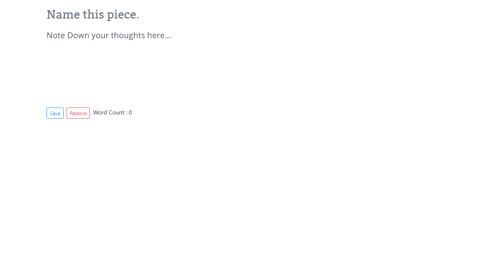

# A Simple Distraction free, no extra gimmick, writing tool

URL : https://skadimoolam.github.io/Simple-Writing-Tool/

## Features
 - Simplest possible writing tool
 - Nothing extra
 - No Flashy buttons
 - Can Count your words
 - Can Save your work
 - Can Restore your last save

## How does it Save the work
Both the title and the content are saved in LocalStorage and can be retrieved when you want to continue writing.
Also note that this only saves your most recent work and cannot save multiple pieces.

## License
MIT License

Copyright (c) 2018 Adi <skadimoolam@gmail.com>